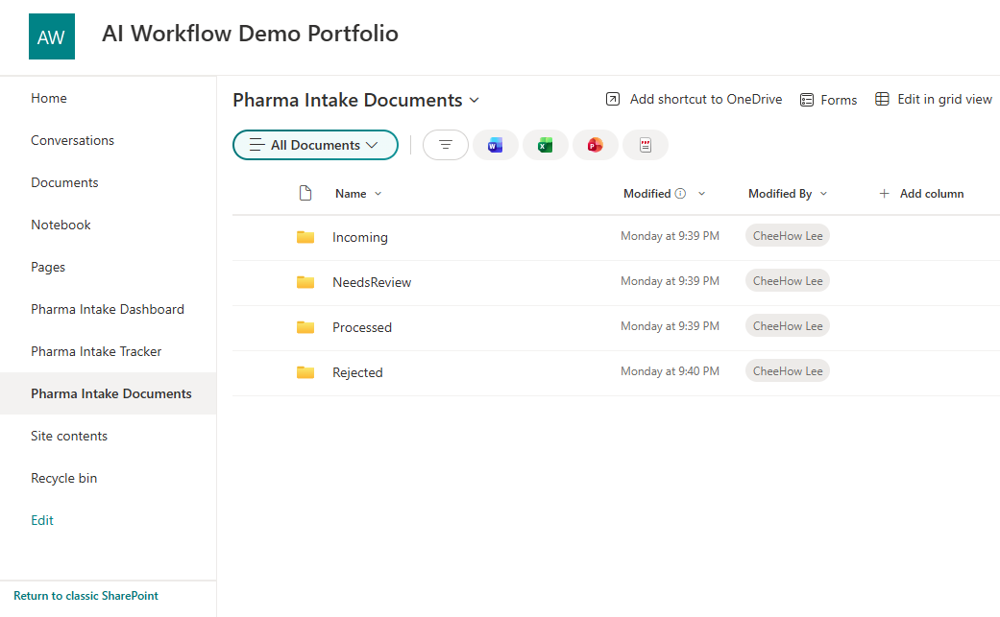
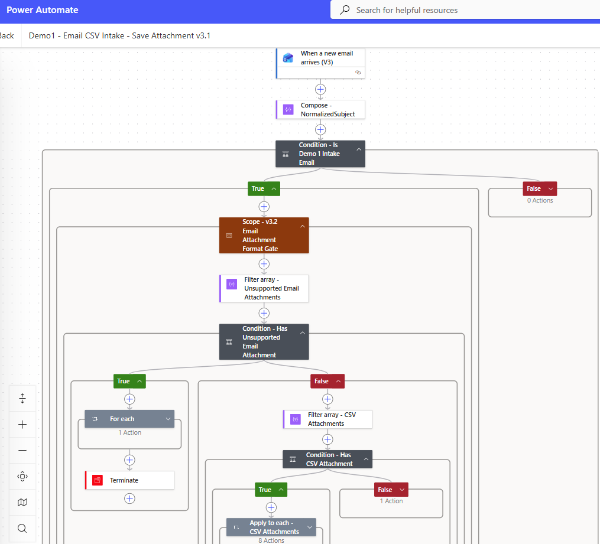
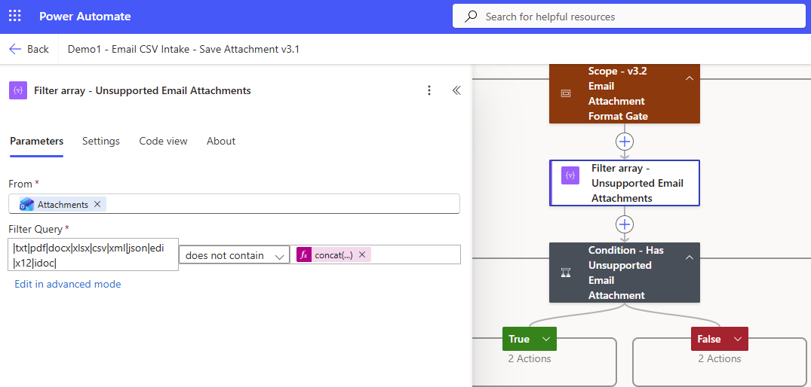
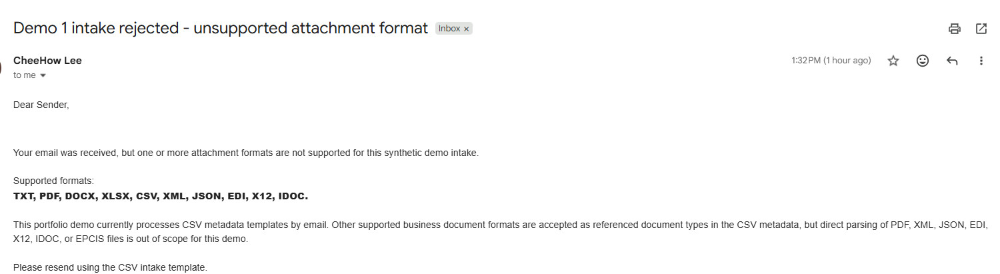
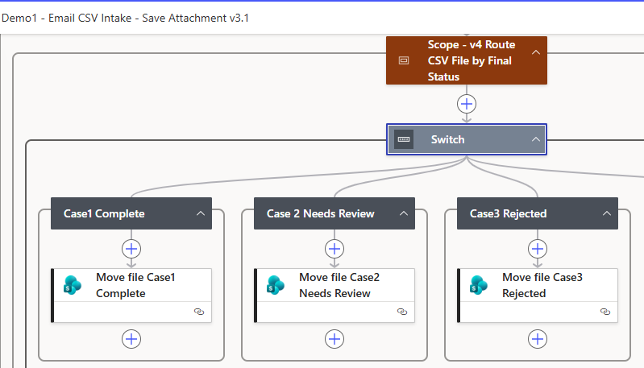
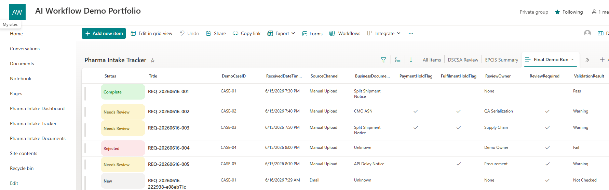
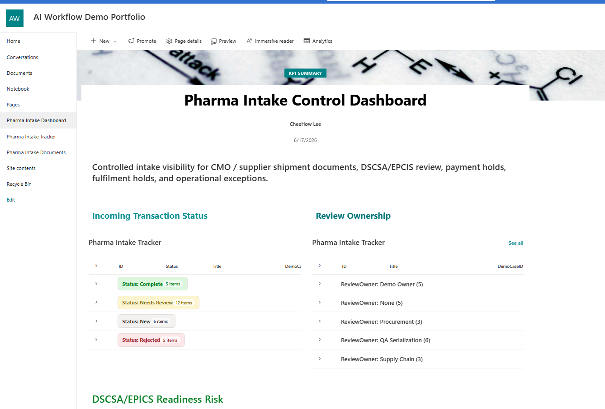
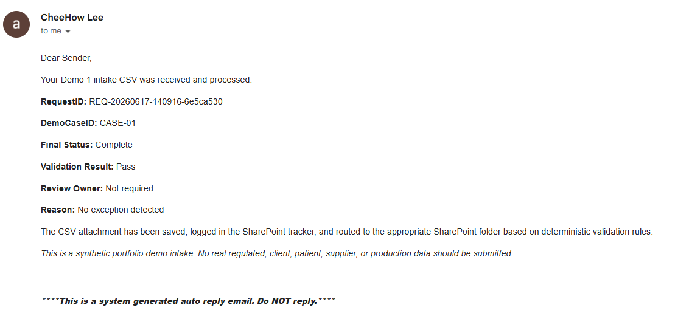
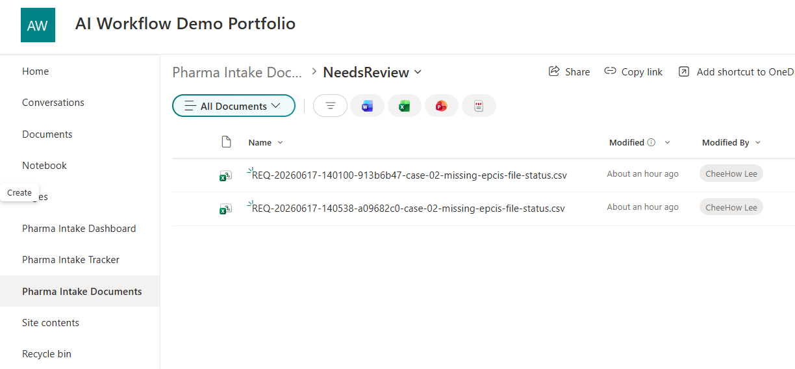

# Pharma / MedTech M365 Controlled Document Intake Demo

A Microsoft 365 workflow automation demo showing how a pharma / medtech operations team can move from email-based document chasing to a controlled intake workflow with SharePoint storage, SharePoint tracker records, deterministic validation rules, exception routing, file movement, dashboard visibility, and final sender replies.

This is Demo 1 of the AI Workflow Automation Portfolio.

Repository: `pharma-m365-controlled-intake-demo`

---

## 1. Demo Summary

This demo simulates a US pharmaceutical brand owner receiving synthetic intake documents from a Taiwan CMO and China API supplier.

The scenario covers CMO / supplier document intake related to:

* PO / ASN / invoice linkage
* batch / lot tracking
* split shipment handling
* US 3PL readiness
* DSCSA / EPCIS readiness metadata
* payment hold visibility
* fulfilment hold visibility
* procurement, supply chain, QA serialization, and demo-owner review routing

The workflow uses Microsoft 365 standard connectors and SharePoint as the control layer.

The current build does not use active AI processing. The design follows a deterministic workflow spine first. AI extraction, classification, summarization, and draft response generation are documented as future enhancers only.

---

## 2. Business Problem

In many operations teams, supplier and CMO documents arrive by email and are handled manually.

Typical issues:

* staff download attachments manually
* files are saved inconsistently
* Excel trackers become outdated
* missing EPCIS readiness or quantity details are discovered late
* finance cannot see whether payment should be held
* supply chain cannot see whether fulfilment should be held
* QA / serialization review is triggered through email chasing
* managers lack a clean exception view

This demo shows a lightweight Microsoft 365 pattern for turning scattered email intake into a controlled, auditable workflow.

---

## 3. Before and After Workflow

### Before

```text
Supplier / CMO email received
-> staff manually downloads attachment
-> staff manually saves file
-> staff manually reads document
-> staff updates tracker manually
-> missing fields are chased by email
-> review ownership is unclear
-> manager asks for status separately
```

### After

```text
Email with CSV intake template received
-> Power Automate validates attachment format
-> CSV attachment saved to SharePoint /Incoming
-> CSV metadata parsed
-> SharePoint tracker item created
-> deterministic validation rules assign status and owner
-> CSV file routed by final status
-> sender receives final reply email
-> SharePoint views and dashboard show status, owner, and hold visibility
```

---

## 4. Architecture

```text
External sender email
        |
        v
Office 365 Outlook trigger
        |
        v
Attachment format gate
        |
        v
CSV attachment filter
        |
        v
SharePoint Document Library
/Incoming
        |
        v
CSV parse + deterministic validation
        |
        v
SharePoint List tracker
        |
        v
Status / owner / hold flags / reason
        |
        v
File routing by final status
        |
        +--> Complete      -> /Processed
        +--> Needs Review  -> /NeedsReview
        +--> Rejected      -> /Rejected
        |
        v
Final reply email to sender
        |
        v
SharePoint dashboard views
```

---

## 5. Tool Stack

| Layer                      | Tool                           |
| -------------------------- | ------------------------------ |
| Email trigger              | Office 365 Outlook             |
| Workflow automation        | Power Automate cloud           |
| File storage               | SharePoint Document Library    |
| Workflow control table     | SharePoint List                |
| Dashboard                  | SharePoint list views and page |
| Source control / portfolio | GitHub                         |
| Input files                | Synthetic CSV and TXT samples  |

No premium connector assumption is required for the current build.

---

## 6. Repository Structure

```text
pharma-m365-controlled-intake-demo/
├── README.md
├── docs/
├── harness/
├── sample-data/
│   ├── txt-business-docs/
│   │   ├── sample-01-complete-cmo-split-shipment-intake.txt
│   │   ├── sample-02-missing-epcis-file-status.txt
│   │   ├── sample-03-split-shipment-quantity-mismatch.txt
│   │   ├── sample-04-unsupported-file-type.txt
│   │   └── sample-05-api-material-delay-note.txt
│   │
│   └── csv-email-templates/
│       ├── case-01-complete-cmo-split-shipment-intake.csv
│       ├── case-02-missing-epcis-file-status.csv
│       ├── case-03-split-shipment-quantity-mismatch.csv
│       ├── case-04-unsupported-file-type.csv
│       └── case-05-api-material-delay-note.csv
│
└── screenshots/
    ├── 01-sharepoint-library-final-folders.png
    ├── 02-power-automate-collapsed-flow-overview.png
    ├── 03-v3-deterministic-validation-scope.png
    ├── 04-v32-unsupported-attachment-gate.png
    ├── 05-v4-file-routing-switch.png
    ├── 06-sharepoint-tracker-final-demo-run.png
    ├── 07-dashboard-status-summary.png
    ├── 08-final-reply-case01-complete.png
    ├── 09-final-reply-case04-rejected.png
    └── 10-folder-routing-processed-needsreview-rejected.png
```

---

## 7. Sample Data

The repo contains two types of synthetic sample files.

### 7.1 TXT business documents

These describe the business scenario in human-readable format.

Path:

```text
/sample-data/txt-business-docs/
```

Purpose:

* explains the synthetic CMO / supplier scenario
* gives business context for each test case
* supports portfolio storytelling

### 7.2 CSV email templates

These are the actual one-row CSV templates used in the Power Automate email intake flow.

Path:

```text
/sample-data/csv-email-templates/
```

Purpose:

* each CSV represents one synthetic email intake case
* Power Automate saves the CSV attachment
* the flow parses the CSV metadata
* deterministic validation rules calculate the final outcome

---

## 8. Test Cases

| Case    | Scenario                                       | Expected Status | Expected Owner   | Expected Validation Result | Expected Routing |
| ------- | ---------------------------------------------- | --------------- | ---------------- | -------------------------- | ---------------- |
| CASE-01 | Complete CMO split-shipment intake             | Complete        | Not required     | Pass                       | `/Processed`     |
| CASE-02 | Missing EPCIS file status                      | Needs Review    | QA Serialization | Warning                    | `/NeedsReview`   |
| CASE-03 | Split-shipment quantity mismatch               | Needs Review    | Supply Chain     | Warning                    | `/NeedsReview`   |
| CASE-04 | Unsupported file type declared in CSV metadata | Rejected        | Demo Owner       | Fail                       | `/Rejected`      |
| CASE-05 | API material delay note                        | Needs Review    | Procurement      | Warning                    | `/NeedsReview`   |

---

## 9. Deterministic Validation Logic

The workflow does not trust pre-filled CSV values for final outcome fields.

Instead, Power Automate calculates these fields using deterministic rules:

* `Status`
* `ValidationResult`
* `ReviewOwner`
* `ReviewRequired`
* `DSCSAReviewRequired`
* `PaymentHoldFlag`
* `FulfilmentHoldFlag`
* `MissingFields`
* `ErrorReason`
* `LastUpdatedDateTime`
* `RecordCount`

Main validation rules:

| Rule                                                                         | Outcome                                       |
| ---------------------------------------------------------------------------- | --------------------------------------------- |
| Unsupported referenced file type                                             | `Rejected`, `Fail`, `Demo Owner`              |
| EPCIS required but EPCIS status is blank, missing, unknown, or not confirmed | `Needs Review`, `Warning`, `QA Serialization` |
| Split shipment missing remaining quantity or estimated remaining ship date   | `Needs Review`, `Warning`, `Supply Chain`     |
| API material delay notice                                                    | `Needs Review`, `Warning`, `Procurement`      |
| No exception detected                                                        | `Complete`, `Pass`, no review owner           |

Supported referenced business document formats:

```text
TXT, PDF, DOCX, XLSX, CSV, XML, JSON, EDI, X12, IDOC
```

Note: the current demo accepts these as referenced document formats in the CSV metadata. It does not parse PDF, XML, JSON, EDI, X12, IDOC, or EPCIS payloads.

---

## 10. File Routing Logic

After the tracker item is created, the CSV attachment is routed based on the calculated final status.

| Final Status | Destination Folder |
| ------------ | ------------------ |
| Complete     | `/Processed`       |
| Needs Review | `/NeedsReview`     |
| Rejected     | `/Rejected`        |

This keeps the SharePoint Document Library aligned with the tracker status.

---

## 11. Final Reply Email

After processing, the sender receives a final reply email containing:

* RequestID
* DemoCaseID
* Final Status
* Validation Result
* Review Owner
* Reason
* synthetic demo disclaimer

The reply email helps show the end-to-end workflow from intake to controlled response.

---

## 12. Screenshot Evidence

### SharePoint library folder structure



### Power Automate collapsed flow overview



### v3 deterministic validation scope



### v3.2 unsupported attachment gate



### v4 file routing switch



### SharePoint tracker final demo run



### Dashboard status summary



### Final reply email for CASE-01 Complete



### Final reply email for CASE-04 Rejected


### Folder routing evidence



---

## 13. What This Demo Proves

This demo proves the following workflow automation capabilities:

* email attachment intake
* SharePoint document storage
* SharePoint tracker creation
* deterministic validation rules
* exception routing
* status lifecycle handling
* payment and fulfilment hold flags
* review owner assignment
* file movement based on calculated outcome
* sender reply email
* dashboard visibility
* synthetic regulated-operations-inspired scenario design
* human-review-first control pattern

The purpose is not to show a complex AI stack. The purpose is to show a controlled workflow pattern that can be explained, tested, and handed over.

---

## 14. AI Boundary

AI is not active in the current build.

The current implementation uses deterministic Power Automate rules for validation and routing.

Potential future AI enhancer areas:

* extract PO / ASN / invoice / lot references from unstructured documents
* classify business document type
* summarize supplier or CMO exception notes
* draft internal follow-up messages
* suggest review owner before human confirmation

AI should not be used for:

* final QA disposition
* DSCSA compliance signoff
* EPCIS validation
* payment approval
* fulfilment release
* external communication without review
* replacing deterministic validation rules

---

## 15. Limitations

This is a portfolio prototype using synthetic data only.

It is not:

* a validated GxP system
* a 21 CFR Part 11 compliant system
* a DSCSA compliance platform
* an EPCIS validation engine
* an ERP integration
* an EDI integration
* an AP automation system
* an AR automation system
* a production supplier portal
* a production document management system
* a real client deployment

The demo does not include:

* real regulated data
* real client data
* real patient data
* real supplier data
* real employer-confidential data
* actual EPCIS XML / JSON parsing
* actual EDI / X12 / IDOC parsing
* RAG
* n8n
* local LLM
* FastAPI
* Graph API
* production authentication design
* production DLP or compliance configuration

A production version would require tenant-specific governance, access control, audit retention, data classification, validation documentation, security review, and approved AI/service configuration.

---

## 16. Future Improvements

Possible future improvements:

* add a video walkthrough link
* add a Power BI dashboard
* support multi-row CSV processing
* add dedicated exception log list
* improve final FileLink after file movement
* add AI-assisted extraction using approved tenant tools
* add human approval workflow for review resolution
* add document generation for exception summary
* add Power Apps review screen
* add controlled parsing for structured XML / JSON samples
* add a generic SME clone of the same pattern for non-pharma intake

---

## 17. Portfolio Relevance

This demo is designed to show practical workflow automation capability for roles and client contexts involving:

* AI solution consulting
* digital transformation
* Power Platform / M365 workflow automation
* operational process automation
* pharma / medtech supply-chain operations
* supplier / CMO / 3PL coordination
* controlled intake and exception routing
* audit-friendly workflow design
* SME workflow automation using existing Microsoft 365 tools

The core design principle is:

```text
Deterministic workflow spine first.
AI only as a controlled enhancer.
Human review for risky decisions.
Auditability and exception handling built into the workflow.
```

---

## 18. Walkthrough Video

Video walkthrough: to be added later.

Planned walkthrough flow:

```text
Business problem
-> sample CSV intake
-> Power Automate flow
-> SharePoint tracker
-> deterministic validation
-> file routing
-> final reply email
-> dashboard visibility
-> limitations
```
